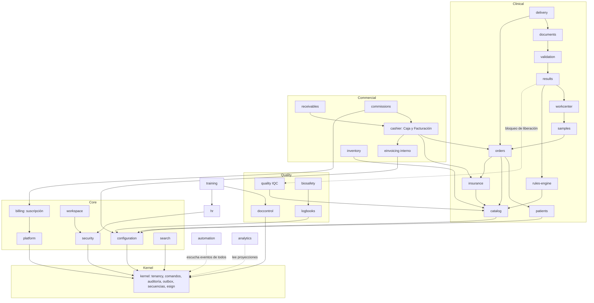

# MICROSLAB 3.0 Enterprise — Architecture Freeze Report (pre-F1)

**Estado:** propuesto para aprobación · 27 de septiembre de 2026
**Frase de aprobación requerida:** `ARCHITECTURE FREEZE APPROVED — START F1`

Este informe consolida la especificación maestra *MICROSLAB 3.0 ENTERPRISE — Master Architecture Freeze* con la arquitectura ya
documentada (documento *MICROSLAB 3.0 — Arquitectura definitiva*, paquete de diseño pre-F1, Design System 1.0) y con el código de
F0 de este repositorio. Donde la especificación maestra y lo existente difieren, gana la especificación maestra salvo que una
dependencia técnica lo impida; esos casos se señalan como contradicción con una propuesta y quedan para tu aprobación.

Nada de este informe es código funcional, migración, tabla ni pantalla. El código de F0 no se modificó.

## Resumen para decidir

| Tema | Resultado |
| --- | --- |
| Principios innegociables | Se conservan todos los de F0 y se agregan multi-moneda, multi-idioma y observabilidad como preparación obligatoria |
| Contradicciones encontradas | 24 (sección 0), 19 resueltas aplicando la especificación maestra, 5 con propuesta que necesita tu decisión |
| Módulos | 55 propuestos (38 registrados en F0 + 11 ya documentados + 6 nuevos), `einvoicing` interno y no visible |
| Roadmap | Se adopta el orden de la especificación maestra con 4 ajustes por dependencia (catálogo y ARS antes de órdenes; PDF y entregas antes de V1; fase de preparación V1; ubicación de la Puerta V1) |
| Decisiones pendientes | 19 (sección 35); ninguna bloquea F1 salvo D-01 a D-04 |
| ADR | 0001–0004 vigentes (0001 y 0003 con adenda); 0005–0024 nuevas en `docs/adr` |

---

## 0. Contradicciones entre la arquitectura existente y la especificación maestra

| ID | Tema | Arquitectura existente | Especificación maestra | Resolución |
| --- | --- | --- | --- | --- |
| C-01 | Nombre del plan gratuito | "Start" (RD$0 + 2 %) | "FREE" (RD$0 + 2 %) | Se adopta FREE; el nombre es configurable (D-02 confirma) |
| C-02 | Período de gracia | Pendiente de decisión | 5 días calendario, luego SUSPENDED | Adoptado |
| C-03 | Estados de suscripción | Estados de cuenta sin enumerar | ACTIVE, GRACE_PERIOD, SUSPENDED, CANCELLED | Adoptado |
| C-04 | Suspensión | Sin reglas sobre acceso clínico | No bloquea resultados, historial ni continuidad clínica | Adoptado; nueva etapa en la tubería de comandos (sección 7) |
| C-05 | e-CF visible como módulo | "Facturación electrónica" en el sidebar de Finanzas y monitor propio | `einvoicing` interno; el usuario ve **Caja y Facturación** con pestañas; Mantenimiento Fiscal solo para roles autorizados | Adoptado; se corrige la navegación |
| C-06 | Estados fiscales | Un solo estado por documento | Separar estado fiscal interno y estado externo (DGII/proveedor) | Adoptado: dos campos y un mapeo versionado |
| C-07 | Contingencias fiscales | A (conectividad) y B (imposibilidad técnica con comprobante no electrónico) | Connectivity Contingency y Technical Contingency, más Reconciliation Center y Emergency Mode | Adoptado; B se renombra Technical y el comprobante no electrónico queda solo si la norma y una declaración lo permiten |
| C-08 | Permisos fiscales | `einvoicing.issue`, `.void_unused`, `.declare_contingency_b`… | Lista de 10 permisos de la especificación | Se adopta la lista maestra y se conservan los adicionales necesarios (sección 30) |
| C-09 | Mantenimiento Fiscal | Configuración, rangos y monitor dispersos | Módulo interno con configuración, certificados, monitor, cola, rechazados, reconciliación, secuencias, diagnóstico, emergencia | Adoptado (sección 15) |
| C-10 | Proveedores fiscales | Adaptador "DGII directo o proveedor, a decidir" | Abstracción para DGII Direct, Sandbox, Provider A, Provider B y futuros | Adoptado; el primero en implementarse es D-03 |
| C-11 | Roadmap: F0 | F0 = fundaciones (ya construidas y probadas) | F0 = Architecture Freeze | F0 queda como "Fundaciones + Architecture Freeze"; lo construido no se rehace |
| C-12 | Roadmap: seguridad y core | Usuarios, roles, MFA y configuración en F1 | F1 seguridad y fundaciones; F2 tenants, sucursales, usuarios, roles, permisos | Adoptado: F1 = seguridad técnica (autenticación, MFA, sesiones, AppShell); F2 = administración del core |
| C-13 | Roadmap: catálogo clínico y ARS | F2 catálogo, F3 pacientes y ARS | No aparecen antes de F3 | **Propuesta:** F3 incluye catálogo y ARS porque una orden no existe sin estudios ni coberturas |
| C-14 | Roadmap: Caja | F4, antes de muestras y resultados | F7, después de resultados | Adoptado; mientras tanto las órdenes existen sin cobro en ambientes de prueba |
| C-15 | Roadmap: PDF, entrega, QR | F7 | QR/portales en F16; PDF y entrega sin fase explícita | **Propuesta:** PDF clínico, verificación QR mínima, registro de entregas y Result Delivery Calendar en F6, porque el flujo clínico no cierra sin ellos |
| C-16 | Calidad para V1 | Decisión pendiente (sección 13 del paquete pre-F1) | V1 exige IQC básico, temperaturas, incidentes de bioseguridad, SOP críticos y tablero básico | Adoptado; ADR 0010 pasa a aceptada |
| C-17 | Ubicación de la Puerta V1 | Tras F10 (consola SaaS) | No se indica | **Propuesta:** fase F7B "V1 Readiness" y Puerta V1 al cerrarla (D-01) |
| C-18 | HR | Puestos dentro de `training` (calidad) | Dominio HR propio | Adoptado: `hr` es dueño de empleados, puestos, departamentos y contratos; `training` usa sus datos (D-04 confirma el reparto) |
| C-19 | Analytics y BI | Un solo módulo `analytics` | Separados | Adoptado: `analytics` (operación) y `bi` (dirección) |
| C-20 | IA | Módulo `ai` | Dominio `clinical-ai`, nunca "Copilot" | Adoptado: se renombra en el registro |
| C-21 | Work Center | Centrado en el bioanalista | Sample-centric y multi-centro (8 centros) | Adoptado: el Work Center pasa a ser el motor de colas de todos los centros |
| C-22 | Offline | Operacional frente a fiscal | Operational Offline, Fiscal Contingency, Network Failure, Technical Failure | Adoptado (sección 26) |
| C-23 | Design System | Valores de Figma con contraste señalado | Figma es la fuente visual; si choca con accesibilidad, gana accesibilidad | Adoptado: variante accesible del botón de confirmación (sección 31) |
| C-24 | Registro de módulos en código | `packages/contracts/src/modules.ts` registra 38 módulos con fases antiguas | 55 módulos y roadmap nuevo | Se actualiza en el primer commit de F1, después de la aprobación; no se toca ahora |

---

## 1. Architecture overview

MicroSlab 3.0 es un **monolito modular multi-tenant**: un backend NestJS sobre un kernel sin framework, PostgreSQL 16 con
Row-Level Security forzado, una tubería única de comandos con auditoría encadenada y outbox transaccional, colas BullMQ para el
trabajo asíncrono, y aplicaciones React + Vite separadas por audiencia.

```
apps/
  api/             Backend: kernel + módulos + adaptador NestJS (HTTP) + worker
  web/             App del personal del laboratorio
  console/         Super Admin (plataforma)
  verify/          Verificación pública de QR
  patient-portal/  Portal del paciente (autenticación propia)
  doctor-portal/   Portal del médico (autenticación propia)
  connector/       Conector local de equipos y nodo fiscal de contingencia
packages/
  contracts/       Registro de módulos, permisos, errores, esquemas y contratos de API
  ui/ expressions/ domain-types/ testing/   (preparados)
infra/db/          Migraciones SQL, bootstrap de roles, pruebas de base de datos
tools/             Generador y verificador de fronteras de módulos
docs/adr/          Decisiones de arquitectura
docs/architecture/ Este informe
```

Se conservan sin cambios las decisiones de F0 que la especificación pide mantener: PostgreSQL, RLS forzado, auditoría inmutable
encadenada por laboratorio, outbox, idempotencia, secuencias, tubería de comandos, registro de módulos, verificador de fronteras,
adaptador NestJS y kernel independiente de la infraestructura (ADR 0001–0004).

Preparación obligatoria que se agrega al marco (sin implementarla ahora):

- **Multi-moneda:** todo monto se modela como `amount` + `currency` (ISO 4217); moneda por defecto por laboratorio; tasas de cambio como datos versionados con fuente.
- **Multi-idioma:** textos de interfaz por clave (`es-DO` por defecto); formatos de fecha, número y moneda por `locale` del laboratorio y del usuario.
- **Observabilidad:** logs estructurados con `request_id` (ya en F0), métricas, trazas y salud de colas (sección 36 de riesgos y ADR 0003).

## 2. Domain map

| Dominio | Qué resuelve | Módulos |
| --- | --- | --- |
| Core | Identidad, organización, configuración y trazabilidad | `platform`, `security`, `configuration`, `audit`, `notifications`, `search`, `workspace`, `approvals` |
| Clinical | Del paciente al resultado entregado | `catalog`, `rules-engine`, `patients`, `orders`, `samples`, `results`, `validation`, `documents`, `workcenter`, `delivery` |
| Commercial | Cobro, crédito, compras y costos | `cashier` (Caja y Facturación), `receivables`, `insurance`, `expenses`, `budgets`, `purchasing`, `suppliers`, `payables`, `inventory`, `costing` |
| Fiscal (interno) | Documentos fiscales electrónicos | `einvoicing` (no visible como módulo principal) |
| Operations | Agenda y servicios fuera del flujo central | `scheduling` (Agenda Enterprise), `imaging`, `home-collection`, `logistics` |
| Quality | Calidad, cumplimiento y documentación controlada | `doccontrol`, `quality` (IQC/EQC), `logbooks`, `biosafety`, `equipment`, `reagents`, `training`, `internal-audits`, `capa`, `compliance` |
| HR | Personal y estructura | `hr` |
| Builders | Construcción configurable sin programar | `reports` (Report Builder), `forms` (Form Builder), `documents` (PDF y Label Builder), `catalog` (Study y Profile Builder) |
| Intelligence | Medición, dirección, asistencia y automatización | `analytics`, `bi`, `clinical-ai`, `automation`, `voice` |
| Communication | Canales | `notifications` (WhatsApp, email, SMS), `integrations` (webhooks) |
| External | Terceros y público | `portals`, `integrations` (API pública, conector de equipos); apps `verify`, `patient-portal`, `doctor-portal`, `connector` |
| SaaS | Negocio de MicroSlab | `platform` (Super Admin), `billing` (Subscription + Billing Engine), `commissions` |

## 3. Module map

55 módulos en el registro. **Nuevo** = no existe en el registro de F0; se registra como esqueleto en el primer commit de F1.

| Módulo | Dominio | Estado en el registro | Fase propuesta |
| --- | --- | --- | --- |
| `platform` | Core / SaaS | F0 | F2 (provisión) · F7B (consola V1) |
| `security` | Core | F0 | F1 |
| `configuration` | Core | F0 | F1 (Configuration Engine) · F2 (sucursales) |
| `audit` | Core | F0 (motor listo) | F1 (visor) |
| `notifications` | Core / Communication | F0 | F1 (in-app) · F6 (email, WhatsApp) |
| `search` | Core | Nuevo (documentado) | F1 |
| `workspace` | Core | Nuevo (documentado) | F1 |
| `approvals` | Core | F0 | F8 |
| `catalog` | Clinical / Builders | F0 | F3 |
| `rules-engine` | Clinical | F0 | F3 (definición) · F6 (evaluación, críticos, delta) |
| `patients` | Clinical | F0 | F3 |
| `orders` | Clinical | F0 | F3 |
| `samples` | Clinical | F0 | F3 (toma e identificación) · F5 (recepción, custodia) |
| `results` | Clinical | F0 | F6 |
| `validation` | Clinical | F0 | F6 |
| `documents` | Clinical / Builders | F0 | F6 (PDF clínico, QR) · F15 (PDF y Label Builder) |
| `workcenter` | Clinical / Operations | F0 | F4 · F5 |
| `delivery` | Clinical | **Nuevo** | F6 (registro de entregas y Result Delivery Calendar) |
| `cashier` | Commercial (Caja y Facturación) | F0 | F7 |
| `einvoicing` | Fiscal interno | Nuevo (documentado) | F7 |
| `receivables` | Commercial | F0 | F7 |
| `insurance` | Commercial | F0 | F3 (coberturas) · F7 (reclamaciones y glosas) |
| `commissions` | SaaS | F0 | F7 |
| `billing` | SaaS | F0 | F2 (estado de suscripción) · F7 (Billing Engine) |
| `inventory` · `suppliers` · `purchasing` · `payables` | Commercial | F0 | F8 |
| `expenses` · `budgets` | Commercial | F0 | F8 (gastos, centros de costo) · F17+ (presupuestos) |
| `costing` | Commercial | F0 | F17+ |
| `scheduling` | Operations | F0 | F9 (Agenda Enterprise) |
| `imaging` | Operations | F0 | F9 (agenda de imágenes) · F17+ (informes) |
| `home-collection` | Operations | F0 | F17+ |
| `logistics` | Operations | **Nuevo** | F17+ (transporte de muestras entre sucursales) |
| `analytics` | Intelligence | F0 | F10 (Operations Center y analítica operativa) |
| `bi` | Intelligence | **Nuevo** | F17+ |
| `doccontrol` · `logbooks` · `quality` · `biosafety` | Quality | Documentados; `biosafety` **nuevo** | F7B (mínimo V1) · F11 · F13 |
| `training` · `internal-audits` · `capa` · `compliance` · `equipment` · `reagents` | Quality | Documentados | F11 · F13 |
| `hr` | HR | **Nuevo** | F12 |
| `automation` | Intelligence | **Nuevo** | F14 |
| `reports` · `forms` | Builders | F0 | F7 (reportes base) · F15 (builders) |
| `clinical-ai` | Intelligence | F0 como `ai` (se renombra) | F17+ |
| `voice` | Intelligence | F0 | F17+ |
| `integrations` | External | F0 | F16 (API y webhooks) · F17+ (equipos) |
| `portals` | External | F0 | F16 |

El **Operations Center** es una superficie de la app web que compone datos de `analytics`, `workcenter`, `delivery`, `cashier`,
`quality` e `inventory`; no tiene tablas propias salvo sus diseños guardados en `workspace`.

## 4. Dependency graph

Una flecha significa "depende de". Los módulos se comunican por comandos públicos y eventos del outbox; nunca por tablas ajenas.



Reglas del grafo:

- **Sin ciclos.** La única dependencia inversa (liberación de resultados ← control de calidad) es una consulta de política que `validation` hace a `quality` por su interfaz pública; `quality` no conoce a `results`.
- `einvoicing` no depende de ningún módulo comercial: recibe una solicitud de documento fiscal y devuelve su estado.
- `automation`, `analytics`, `bi` y `search` consumen eventos; nunca escriben en tablas de otros módulos.
- El verificador de fronteras (`tools/check-modules.mjs`) sigue siendo la barrera en CI.

## 5. Tenant isolation model

Defensa en profundidad, como exige la especificación:

| Capa | Mecanismo | Estado |
| --- | --- | --- |
| Aplicación | Contexto de tenant resuelto por subdominio + token; debe coincidir o la petición se rechaza | F0 (middleware) |
| Base de datos | `laboratory_id` en toda tabla de tenant, RLS **forzado**, claves foráneas compuestas, rol `microslab_app` sin `BYPASSRLS` | F0, probado |
| Permisos | Permiso por comando con alcance de sucursal | F0 (pipeline) · F1 (desde roles) |
| Auditoría | Cadena SHA-256 por laboratorio, verificable | F0 |
| Plataforma | Super Admin nunca cruza tenants sin una acción explícita, con motivo, tiempo limitado y auditada ("acceso de soporte") | F2 |

Las tablas de plataforma (planes, catálogos normativos, definiciones de configuración, referencias regulatorias) son globales y de solo lectura para la app.

## 6. Security model

- **Autenticación:** usuario + contraseña con política configurable, MFA (obligatorio para Super Admin, administradores y roles fiscales), sesiones revocables, dispositivos registrados, bloqueo por intentos.
- **Autorización:** RBAC con permisos granulares `módulo.acción` y alcance por sucursal; resueltos en el backend desde roles (F1); nunca en el frontend.
- **Acciones sensibles:** reautenticación, motivo obligatorio y, donde se configure, **doble autorización** (segundo usuario con permiso aprueba el mismo comando antes de ejecutarlo; modelado en `approvals`).
- **Eventos de seguridad:** inicios de sesión, fallos, cambios de rol, accesos de soporte, actividad sospechosa (horario, volumen, ubicación) → auditoría y alerta.
- **Secretos y llaves:** en el gestor de llaves del proveedor de nube; nunca en frontend, `localStorage`, logs, respuestas de API ni archivos públicos (ADR 0009).
- **Datos clínicos y financieros:** sin borrado físico; corrección, anulación, reverso o versión nueva (sección 0 regla 64 de la especificación).

## 7. Command architecture

La tubería de F0 se mantiene y se amplía con una etapa de política de suscripción:

```
Command
→ módulo habilitado por plan
→ política de suscripción (ACTIVE, GRACE_PERIOD, SUSPENDED; lista de operaciones esenciales)   ← nueva
→ permiso (rol, sucursal)
→ motivo / reautenticación / doble autorización si el comando lo exige
→ validación de entrada (Zod)
→ transacción con contexto RLS
    → idempotencia
    → reglas de negocio + cambios de dominio (manejador)
    → auditoría
    → outbox
→ commit
```

- Si algo falla, la transacción revierte: no queda escritura parcial, auditoría falsa ni evento huérfano (probado en F0).
- **Operaciones esenciales** que ninguna suspensión bloquea: consultar y entregar resultados históricos, validar resultados ya procesados, notificar críticos, consultar historia clínica, exportar datos por obligación de conservación. La lista es configuración de plataforma versionada.
- Las escrituras fiscales pasan por la misma tubería; sus efectos externos (firma, transmisión) ocurren después del commit, desde el outbox.

## 8. Event/outbox architecture

- Eventos `modulo.NombreEnPasado` escritos en `kernel.outbox_events` dentro de la transacción (F0).
- `OutboxDispatcher` con `SKIP LOCKED` publica en BullMQ con `jobId` = id del evento: entrega al menos una vez; consumidores idempotentes.
- Colas por módulo; la **cola fiscal** es una cola propia con prioridad, reintentos con espera exponencial, límite de intentos, clasificación de error temporal/permanente y *circuit breaker* por proveedor.
- Monitoreo: profundidad y edad de cada cola, tasa de error y reintentos, con alertas (sección 36, riesgo R-07).

## 9. Audit architecture

`audit.audit_events` ya guarda actor, hora del servidor, tenant, sucursal, acción, entidad, antes, después, motivo, IP, agente,
dispositivo y `request_id` (correlation ID), con cadena SHA-256 por laboratorio y protección contra `UPDATE`/`DELETE`/`TRUNCATE`.

Se agregan (F1): `client_time` y marca `offline` para operaciones sincronizadas, y el tipo de actor `provider` para respuestas de
DGII o proveedores fiscales. La auditoría crítica es inmutable; la auditoría de consulta (lecturas de datos sensibles, descargas,
impresiones) se registra en la misma tabla con acción de lectura.

## 10. Billing architecture

- **Billing Engine** (`billing`): factura a cada laboratorio su suscripción mensual **por adelantado** y, en el mismo estado de cuenta, la comisión del ciclo anterior.
- La factura de MicroSlab es un e-CF emitido por `einvoicing` con MicroSlab como emisor (otra configuración fiscal, mismo motor).
- Estado de cuenta: borrador → emitido → pagado / vencido; pago por pasarela (F17+) o registro manual en consola.
- Precios, tasas, límites y beneficios son datos de plan versionados, nunca código (sección 11 de la especificación, ADR 0012).

## 11. Subscription architecture

| Elemento | Regla |
| --- | --- |
| Planes iniciales | FREE (RD$0 + 2 %), PRO (RD$1,500 + 1 %), ENTERPRISE (RD$3,500 + 0 %); todo configurable: precio, comisión, límites, beneficios, features, usuarios, sucursales, almacenamiento, IA, WhatsApp, API, integraciones, reportes |
| Versionado | Cada plan tiene versiones; una suscripción apunta a la versión vigente en su ciclo |
| Ciclo | Mensual; la mensualidad se cobra al inicio |
| Cambio de plan | Efectivo el primer día del siguiente ciclo; sin prorrateo; historial completo |
| Estados | ACTIVE → GRACE_PERIOD (impago al vencer) → SUSPENDED (tras 5 días calendario, configurable) → ACTIVE al pagar; CANCELLED por decisión explícita |
| Suspensión | Restringe administración, operaciones comerciales nuevas, funciones avanzadas y configuración; nunca lo clínico esencial (sección 7) |
| Trazabilidad | Cada cambio de estado emite evento y auditoría con motivo, fecha, actor (usuario o sistema), estado anterior y nuevo |

## 12. Commission architecture

- Un asiento por **cobro efectivo** (no por factura emitida): tenant, laboratorio, transacción de cobro origen, fecha, monto cobrado, tasa aplicada, comisión, plan y versión vigentes en ese momento, ciclo.
- Sin comisión sobre facturas pendientes, canceladas, anuladas, glosadas ni cuentas no cobradas. Un cobro revertido crea un asiento negativo en el ciclo del reverso; nunca se edita el original.
- Cobros de ARS: la comisión nace cuando entra el dinero, en el ciclo en que entra; el monto glosado nunca genera comisión.
- Las comisiones históricas no se recalculan al cambiar de plan.

## 13. Caja y Facturación architecture

**Caja y Facturación** es el único módulo visible de facturación para el personal operativo. Pestañas:

Facturar · Facturas · e-CF · Notas de Crédito · Notas de Débito · Estado Fiscal · Arqueo de Caja · Estado de Cuenta · Historial de Cobros · Pagos Pendientes · Reimpresión · Contingencia

- `cashier` es dueño de sesiones de caja, facturas comerciales, cobros, anticipos, reembolsos, salidas de efectivo y arqueo.
- Para cada factura, `cashier` solicita un documento fiscal a `einvoicing` (`fiscal_requests`) y guarda solo el enlace (`invoice_fiscal_links`); el número fiscal, el XML y el estado viven en `einvoicing`.
- La pestaña **Estado Fiscal** muestra el estado interno y el externo de cada documento; **Contingencia** muestra si la sucursal o el punto está en contingencia y qué quedó pendiente.
- El cajero nunca ve configuración fiscal, certificados ni secuencias.

## 14. Internal e-invoicing architecture

`einvoicing` es un motor interno. Diseño detallado en la sección 22 del documento de arquitectura; lo que fija este informe:

- **Documentos fiscales:** e-CF, XML, PDF (representación impresa), QR fiscal, hash, firma digital, transmisión, respuesta, rechazo, contingencia, reintentos, reconciliación y auditoría.
- **Estados internos** (provisionales, a validar contra el modelo oficial vigente antes de implementar): DRAFT, READY, SIGNED, PENDING_TRANSMISSION, TRANSMITTED, ACCEPTED, REJECTED, VOIDED, CONTINGENCY, PENDING_RETRY, FAILED.
- **Estado externo separado:** cada documento guarda además `external_status` (el literal que devuelve DGII o el proveedor) y el motor lo traduce al estado interno con un mapeo versionado por proveedor. Nunca se asume que los nombres coinciden.
- **Políticas fiscales:** `Fiscal Policy` + `Fiscal Policy Version` + fuente/referencia + fecha efectiva + auditoría. Incluye plazos de contingencia (`FiscalContingencyPolicy`), tipos aplicables y reglas de uso por tipo de e-CF.
- **Adaptadores de transmisión** (interfaz `FiscalGateway`): `DGII_DIRECT`, `SANDBOX`, `PROVIDER_A`, `PROVIDER_B`, futuros. Solo se diseña la interfaz; ningún conector se implementa hasta D-03.
- **Secuencias:** la autorización fiscal (rango aprobado por la DGII) y la secuencia interna (asignación a un punto de emisión) son entidades distintas (ADR 0006).

## 15. Mantenimiento Fiscal architecture

Módulo interno de `einvoicing` para Super Admin, administrador autorizado, supervisor fiscal y roles con permiso explícito. Vive en
Configuración de la app web (para el laboratorio) y en la consola (para MicroSlab). Resuelve eventualidades fiscales **sin acceso
directo a la base de datos**.

| Área | Contenido |
| --- | --- |
| Configuración | RNC, razón social, nombre comercial, dirección, sucursales, configuración fiscal, tipos de e-CF, series, secuencias, ambientes (sandbox, producción), proveedor fiscal, parámetros; cada cambio versionado con usuario, fecha, IP, dispositivo, motivo, valor anterior y nuevo |
| Certificados / firma digital | Activo, estado, emisión, expiración, días restantes, ambiente, proveedor, última prueba, última rotación; renovar, reemplazar, probar, activar, desactivar; nunca muestra la llave; MFA, reautenticación y doble autorización configurables |
| Monitor fiscal | Aceptados, pendientes, rechazados, contingencia, reintentos, errores, última comunicación, estado de certificado, secuencias, proveedor, DGII y salud del servicio |
| Cola de transmisión | Por documento: e-CF, tipo, fecha, tenant, laboratorio, sucursal, caja, dispositivo, usuario, estado, intentos, último intento, próximo reintento, error, respuesta, marca de tiempo. Acciones: ver, inspeccionar, reintentar, pausar, reanudar, ver XML, PDF, respuesta y auditoría |
| Reintentos | Backoff exponencial, límite de intentos, errores temporales frente a permanentes, reintento automático y manual, circuit breaker por proveedor; toda intervención manual auditada |
| Rejected Documents Center | Documento, motivo, código, respuesta, fecha, usuario, XML, historial y acción recomendada; la corrección usa el mecanismo fiscal (nota de crédito o nuevo documento), nunca editar el emitido |
| Reconciliation Center | Detecta documentos sin respuesta, transmitidos sin confirmación, posibles duplicados, diferencias de secuencia, respuestas sin documento local, pendientes y errores de sincronización; resuelve agregando registros, nunca borrando |
| Monitor de secuencias | Rango autorizado, actual, siguiente, utilizados, pendientes, huecos, conflictos, utilización; nunca inventa secuencias |
| Fiscal Diagnostics | Conectividad, autenticación, certificado, firma, XML, comunicación, proveedor, DGII, cola, almacenamiento, permisos, configuración → PASS / WARNING / ERROR, con auditoría |
| Fiscal Emergency Mode | Requiere permiso especial, motivo, confirmación, auditoría y alerta. Solo permite acciones de contención ya existentes (pausar la cola, declarar contingencia, forzar diagnóstico, escalar alertas); no desbloquea nada que los controles impidan |

**Acciones prohibidas siempre** (no existen como comandos): editar un e-NCF emitido, cambiar manualmente a ACCEPTED, borrar facturas fiscales, XML, respuestas o auditoría, inventar secuencias, eliminar errores sin trazabilidad, modificar documentos históricos fuera del mecanismo fiscal.

## 16. Fiscal contingency architecture

| Tipo | Causa | Qué hace el motor |
| --- | --- | --- |
| Connectivity Contingency | Internet, DGII, proveedor o comunicación | Sigue firmando en el servidor; los documentos quedan en CONTINGENCY o PENDING_TRANSMISSION y se transmiten al volver, dentro del plazo de la política vigente |
| Technical Contingency | Problema interno: firma, XML, certificado, servicio, cola o infraestructura | Detiene la emisión afectada, alerta y registra; usa el mecanismo de contingencia que la norma y la política vigente permitan (incluido el comprobante no electrónico solo si está permitido y declarado) |

Cada contingencia registra inicio, causa, sucursal, dispositivos, documentos afectados, acciones, fin y retransmisión
(`fiscal_contingency_periods`). La sucursal sin internet es un caso de **Operational Offline** (sección 26): allí la emisión fiscal
solo ocurre si existe un nodo fiscal local con llave protegida; si no, la venta queda "pendiente de comprobante".

## 17. Work Center architecture

- **Sample-centric**, no patient-centric: la unidad de trabajo es la muestra (y la tarea sobre ella), aunque la pantalla muestre al paciente como contexto.
- Flujo: Sample Received → Identification → Area Classification → Priority → Worklist → Processing → Result → Rules/Formulas/Delta → Review → Technical Validation → Professional Validation → Delivery → Audit.
- **Centros iniciales:** Reception, Phlebotomy, Laboratory, Validation, Imaging, Cash, Home Laboratory, Quality; se pueden crear más (`work_centers`).
- **Prioridades** (configurables, versionadas): Critical, Urgent, TAT Soon, Delayed, Normal; a la prioridad operacional se suma el riesgo de entrega del Result Delivery Calendar.
- **Áreas preparadas:** Hematology, Chemistry, Immunology, Hormones, Microbiology, Uroanalysis, Coprology, Coagulation, Serology, Toxicology, Molecular, Blood Bank, Imaging y áreas propias.
- **Resultados:** manual, automático, calculado, derivado, corregido; formula engine, delta check, valores críticos, repetición, retención del original, historial, validación técnica y profesional; una corrección nunca destruye el valor anterior.
- **TAT Engine:** marca toma, recepción, procesamiento, resultado, validación y entrega; SLA por estudio y prioridad, alertas, retrasos, tableros y analítica.
- Experiencia detallada: paquete de diseño pre-F1, sección 6; la sección 29 del documento original ("Menos clics") llegó incompleta (D-13).

### Result Delivery Calendar (nuevo requisito obligatorio)

Módulo `delivery`, separado de la agenda de pacientes:

- **Compromiso de entrega** por orden o estudio: fecha y hora prometidas, fecha estimada, fecha y hora de entrega, tipo, responsable, sucursal, prioridad, canal y estado.
- **Estados del compromiso:** PROMISED, IN_PROGRESS, READY, DELIVERED, OVERDUE, CANCELLED, RESCHEDULED; independientes del estado del resultado (un resultado IN_VALIDATION puede tener un compromiso PROMISED para hoy a las 4:00 PM).
- **Calendario:** hoy, mañana, semana, mes, fecha específica; por día: pacientes pendientes, listos, por validar, atrasados y entregados.
- **Lista del día:** paciente, identificación, orden, estudios, sucursal, médico, fecha y hora prometidas, estado del resultado y de la entrega, canal, responsable, prioridad; agrupada en listos, pendientes, atrasados y entregados.
- **Alerta de resultado no listo:** el backend compara hora actual, hora prometida y estado real; niveles INFORMACIÓN, WARNING, URGENTE, OVERDUE con umbrales configurables (p. ej., 24 h, 12 h, 4 h, 2 h, 30 min), nunca fijos en código.
- Las alertas aparecen en Work Center, Mi Trabajo, tablero, Operations Center, Calendario de Entregas y pantalla de resultados; la prioridad operacional combina tiempo restante, estado, TAT, tipo de estudio, prioridad clínica y retraso; se muestra con icono y texto, no solo color.
- Filtros: fecha, sucursal, área, laboratorio, médico, responsable, estado, prioridad, tipo de estudio, canal, paciente.
- Pendiente: la sección 11 ("Entregas en riesgo") y siguientes llegaron cortadas (D-12).

## 18. Quality architecture

- Preparada para Ministerio de Salud Pública y acreditación estilo ISO 15189; sin requisitos legales inventados; reglas regulatorias configurables y versionadas (`compliance`, `regulatory_references`).
- **V1 mínimo obligatorio** (fase F7B, antes de la Puerta V1): IQC básico diario (corrida, reglas básicas, bloqueo de liberación configurable), registros de temperatura, incidentes de bioseguridad, SOP críticos con versión, aprobación, firma electrónica y lectura obligatoria, tablero básico de calidad.
- **Quality I (F11):** control documental completo (código, nombre, categoría, versión, creador, aprobador, fechas, estados Draft / In Review / Approved / Obsolete, PDF, Word, firma, auditoría; nunca se sobrescribe un aprobado), manuales, bitácoras restantes, capacitación ligada a HR, checklist de cumplimiento, calendario.
- **Quality II (F13):** EQC, CAPA completo, auditorías internas completas, gestión de riesgos, competencias, acreditación, equipos y reactivos completos, tablero avanzado.
- `biosafety` (nuevo): incidentes, exposiciones, cortopunzantes y gestión de desechos (manifiestos y retiros), con acceso restringido por tratarse de datos de salud del personal.

## 19. Inventory architecture

Costo **promedio ponderado** por laboratorio, historial completo por movimiento; las transferencias entre sucursales conservan el
costo de origen; nunca se pierde lote, costo, cantidad, origen, destino, usuario, fecha ni movimiento. Kardex inmutable (correcciones
por movimiento de ajuste). Detalle en la sección 19 de la arquitectura.

## 20. HR architecture

`hr` (nuevo, F12) es dueño de empleados, puestos, departamentos, contratos, documentos del empleado, permisos y ausencias, vencimientos
(licencias profesionales, exequátur, certificados) e historial. Relación con otros dominios:

- `security.users` enlaza opcionalmente a un empleado (no todo usuario es empleado, p. ej., soporte).
- `training` (calidad) usa puestos y empleados de `hr` para exigir lecturas, cursos y competencias; el expediente de calidad del empleado es una vista sobre `hr` + `training` (D-04).
- Hasta F12, `training` y los SOP críticos de V1 usan el rol del usuario como puesto provisional.

## 21. Agenda architecture

**Agenda Enterprise** (`scheduling`, F9): pacientes, médicos, recursos, equipos, salas, sucursales, horarios, disponibilidad, bloqueos,
feriados, recurrencias, recordatorios, no-show, lista de espera, sobrecupo configurable; agendas médica, de imágenes, de laboratorio y
domiciliaria. El **Result Delivery Calendar** no es parte de la agenda: vive en `delivery` y comparte solo componentes visuales.

## 22. Automation architecture

`automation` (F14): reglas **Trigger → Conditions → Actions**, versionadas y auditadas. Triggers son eventos del outbox o tiempos
(resultado crítico, paciente listo, factura vencida, certificado por vencer, temperatura fuera de rango, documento pendiente, entrega en
riesgo). Acciones permitidas: notificación (WhatsApp, email, SMS), webhook, tarea interna. Toda acción que escribe datos lo hace
emitiendo un comando por la tubería, con el actor `system` y la regla como motivo; nunca escribe directo.

## 23. Analytics vs BI

| | Analytics (`analytics`) | BI (`bi`) |
| --- | --- | --- |
| Para | Operación diaria | Dirección |
| Mide | TAT, productividad, pendientes, tiempos, calidad, rendimiento | Ingresos, rentabilidad, sucursales, crecimiento, ARS, costos, inventario, tendencias, indicadores ejecutivos |
| Frescura | Casi en tiempo real (proyecciones por eventos) | Diaria o por lote |
| Fase | F10 (con Operations Center) | F17+ |

Ambos leen proyecciones o réplicas de lectura; ninguno consulta tablas de otros módulos en caliente.

## 24. Clinical AI architecture

`clinical-ai` (antes `ai`): asistente que sugiere, resume, detecta anomalías, explica, prioriza, genera borradores y ayuda al
profesional. **Nunca es la autoridad clínica final** ni valida un resultado sin la autorización humana requerida. Sin envío de datos de
pacientes a proveedores externos hasta tu decisión de privacidad (D-15). Sin dominio "Copilot".

## 25. Portals architecture

`patient-portal` y `doctor-portal` son aplicaciones independientes, no vistas de la app interna: autenticación, sesiones, permisos,
seguridad, auditoría y contratos de API propios (`/portal/patient/v1`, `/portal/doctor/v1`), con identidades separadas de los usuarios
del laboratorio. **QR Verification** (`verify`) es pública: confirma autenticidad e integridad del documento sin exponer datos clínicos
innecesarios (código, fecha, laboratorio, hash, estado de vigencia).

## 26. Offline architecture

Cuatro situaciones distintas, nunca tratadas como una:

| Situación | Qué es | Respuesta |
| --- | --- | --- |
| Operational Offline | La sucursal pierde internet | Caja, Recepción y Órdenes siguen: cola local cifrada, ids generados en el equipo, idempotencia, sincronización ordenada, resolución de conflictos, auditoría con hora del equipo |
| Fiscal Contingency | El motor fiscal no puede transmitir o emitir | Sección 16 |
| Network Failure | Falla de red dentro de la infraestructura o hacia proveedores | Reintentos, circuit breaker y colas; sin impacto en datos |
| Technical Failure | Falla de un servicio propio | Degradación controlada por módulo, alertas, recuperación desde outbox |

La implementación del modo sin conexión es una fase propia (D-05); desde F1 todo comando acepta un id generado por el cliente y es
idempotente, y los códigos internos admiten reserva por bloques. Los códigos internos nunca son números fiscales (ADR 0006).

## 27. Equipment integration architecture

`connector` es una aplicación separada, instalada en la sede, aislada del core: habla HL7/ASTM con analizadores, mantiene mapeos de
pruebas, recibe resultados y envía worklists, y se comunica con la API solo por contratos autenticados de `integrations` con idempotencia.
Errores y mensajes quedan registrados; un resultado del equipo entra como origen `automático` y sigue la validación normal. El mismo
binario puede alojar el nodo fiscal local de contingencia, con su llave en el almacén seguro del sistema operativo.

## 28. Builder architecture

| Builder | Módulo | Qué produce | Reglas comunes |
| --- | --- | --- | --- |
| Report Builder | `reports` | Filtros, columnas, agrupaciones, fórmulas, gráficos, exportación PDF/Excel/CSV, programación, permisos | Definiciones versionadas; ejecutan consultas sobre proyecciones con los permisos del usuario |
| Form Builder | `forms` | Campos, tipos, validaciones, reglas, dependencias, firmas, versiones | El formulario lleno es un documento inmutable ligado a la versión |
| PDF Builder | `documents` | Plantillas de resultados, facturas, reportes, documentos, certificados, administrativos | Plantillas versionadas; un PDF emitido nunca se regenera con otra versión |
| Label Builder | `documents` | Etiquetas de muestras, tubos y equipos, códigos de barras y QR | Formatos por impresora; vista previa |
| Study / Profile Builder | `catalog` | Estudios, parámetros, perfiles, fórmulas, rangos | Versiones aprobadas antes de usarse en órdenes |

Las fórmulas de todos los builders usan el mismo evaluador seguro (`packages/expressions`), sin `eval`.

## 29. Configuration hierarchy

Cinco niveles: **Platform → Plan → Laboratory → Branch → User**. Los superiores ponen defaults (y el plan, además, techos); los inferiores
sobrescriben solo donde la definición lo permite. Existen precedencia, valor efectivo, versionado, auditoría, historial y **rollback**
(volver a una versión anterior es un comando nuevo que copia el valor, nunca un borrado). Detalle en el paquete pre-F1, sección 9, y ADR 0013.

## 30. Permission model

`módulo.acción` con alcance por sucursal; roles plantilla por laboratorio editables; permisos que exigen motivo, reautenticación o doble
autorización se declaran en el comando. Permisos fiscales (lista de la especificación, más los necesarios):

`einvoicing.view` · `einvoicing.configure` · `einvoicing.retry` · `einvoicing.contingency.manage` · `einvoicing.reconciliation` ·
`einvoicing.certificate.manage` · `einvoicing.sequence.view` · `einvoicing.sequence.manage` · `einvoicing.diagnostics` ·
`einvoicing.audit.view` · adicionales: `einvoicing.queue.pause` · `einvoicing.emergency` · `einvoicing.export`.

Emitir, anular antes de firmar y crear notas de crédito o débito son permisos de `cashier` (el cajero nunca recibe permisos `einvoicing.*`).

## 31. Design System integration

- **Figma es la fuente visual principal** (estructura, componentes, espaciado, tipografía, iconografía, layout, navegación, estados).
- **Si Figma choca con accesibilidad, gana accesibilidad**: se crean variantes accesibles en lugar de copiar valores que incumplen. Aplicado: el botón de confirmación usa relleno `success-action` #118431 (4.8:1 con texto blanco) en lugar de #31BF48 (2.4:1); #31BF48 queda para usos no textuales. El texto de ejemplo de los campos se mantiene más oscuro que en Figma.
- Tema claro y oscuro, responsive, teclado, foco visible, contraste, estados de error, carga y vacío en todos los componentes.
- Iconografía oficial: Remix Icon (línea); sustitución temporal hasta F1.
- Pendiente: contrastar las pantallas de Figma (límite de consultas del plan Starter de Figma, D-17).

## 32. Navigation model

- Regla: toda función importante a **máximo 3 clics**, usando navegación global (sidebar de 2 niveles), contextual (pestañas, filas, drawers), `Ctrl + K`, búsqueda global y atajos.
- Corrección aplicada: el sidebar de Finanzas muestra **Caja y Facturación** (con sus pestañas) y no un módulo de facturación electrónica; **Mantenimiento Fiscal** aparece en Configuración solo para roles con permisos `einvoicing.*`.
- Nuevas entradas: Operaciones → **Calendario de Entregas**; Inicio → **Operations Center** según rol; Personal → **RR. HH.** (F12).
- `Ctrl + K`: navegar, buscar paciente o muestra, abrir factura u orden, ejecutar acciones autorizadas y consultar comandos; siempre con permisos del backend.

## 33. Roadmap

Se adopta el orden de la especificación maestra. Los ajustes por dependencia están marcados **(ajuste)** y requieren tu aprobación junto con este informe.

| Fase | Contenido | Dependencia que justifica el orden |
| --- | --- | --- |
| F0 | Fundaciones (hecho) + Architecture Freeze (este informe) | — |
| F1 | Security + Design System + Application Foundations: autenticación, MFA, sesiones, dispositivos, AppShell, Configuration Engine, búsqueda y `Ctrl + K`, espacio de trabajo, `esign`, i18n y moneda, observabilidad base; registro de los 55 módulos | Todo lo demás corre dentro de este marco |
| F2 | Core: tenants (provisión desde consola), sucursales, usuarios, roles, matriz de permisos, estado de suscripción y su etapa en la tubería | La suspensión debe existir antes que cualquier operación comercial |
| F3 | Pacientes, órdenes, muestras (toma e identificación) **+ catálogo clínico y ARS (ajuste)** | Una orden requiere estudios, precios y coberturas |
| F4 | Work Center Foundation (centros, colas, prioridades, vistas, asignaciones) | Requiere muestras |
| F5 | Work Center Operations (recepción, TAT Engine, escaneo, supervisor, turnos) | Requiere F4 |
| F6 | Resultados, captura, validación **+ PDF clínico, QR de verificación mínimo, registro de entregas y Result Delivery Calendar (ajuste)** | El flujo clínico no cierra sin documento y entrega |
| F7 | Caja y Facturación + `einvoicing` + Mantenimiento Fiscal + Billing, Subscription y Commission Engines; CxC y reclamaciones ARS | Requiere órdenes, ARS y suscripción |
| F7B | **V1 Readiness (ajuste):** Quality V1 mínimo, consola Super Admin para operar V1, certificación e-CF, piloto | Puerta V1 |
| **Puerta V1** | Laboratorio piloto en producción con e-CF aceptados y Quality V1 mínimo (D-01) | |
| F8 | Inventory, Purchasing, Suppliers (+ CxP, aprobaciones, gastos y centros de costo) | Consumo por prueba requiere catálogo |
| F9 | Agenda Enterprise (+ agenda de imágenes) | Requiere pacientes, recursos y sucursales |
| F10 | Operations Center / Analytics | Requiere eventos de los módulos operativos |
| F11 | Quality I | Requiere control documental y firma |
| F12 | HR | Integra con Quality I |
| F13 | Quality II | Requiere HR y equipos |
| F14 | Automation Engine | Requiere eventos estables de todos los dominios |
| F15 | Report / Form / PDF / Label Builders | Reemplazan plantillas fijas de F6–F7 |
| F16 | Portals / QR completo / External APIs y webhooks | Requiere contratos estables |
| F17+ | Integraciones de equipos, integraciones avanzadas, IA clínica, voz, BI, presupuestos y costos, domicilio, logística, modo sin conexión (si no se adelanta), expansión regional | Cada una con su piloto |

## 34. Risks

| ID | Riesgo | Impacto | Mitigación |
| --- | --- | --- | --- |
| R-01 | Norma fiscal cambia o se interpreta mal | Documentos rechazados, sanciones | Políticas y referencias versionadas con fuente; validar contra documentación oficial antes de F7; revisión con contador |
| R-02 | Certificación e-CF tarda más de lo previsto | Retrasa la Puerta V1 | Empezar la certificación del emisor durante F6; sandbox desde F7 |
| R-03 | Llave de firma comprometida | Emisión fraudulenta | Gestor de llaves, acceso por identidad de servicio, rotación, revocación y alertas |
| R-04 | Duplicado o hueco de e-NCF por concurrencia o caída | Inconsistencia fiscal | Asignación atómica, restricción única, estados persistidos antes de cada efecto externo, Reconciliation Center |
| R-05 | Fuga entre tenants | Crítico | RLS forzado, claves compuestas, pruebas de aislamiento en CI (ya en F0) y pruebas por módulo nuevo |
| R-06 | Suspensión bloquea continuidad clínica | Riesgo para pacientes | Lista de operaciones esenciales en la tubería, probada |
| R-07 | Colas atascadas (fiscal, notificaciones, outbox) | Entregas o e-CF tardíos | Monitoreo de profundidad y edad, alertas, circuit breaker |
| R-08 | Alcance de V1 demasiado grande (55 módulos preparados) | Retraso | Esqueletos sin funcionalidad; solo F1–F7B construyen |
| R-09 | Figma incompleto o inaccesible | Pantallas sin referencia | Design System como contrato; contraste pendiente en D-17 |
| R-10 | Requisitos que llegan cortados (Work Center §29, Delivery Calendar §11) | Diseño incompleto | Registrados como D-12 y D-13; nada se infiere |
| R-11 | Datos de salud a terceros (IA, WhatsApp, proveedor fiscal) | Legal y reputacional | Sin envío hasta decisión explícita; minimización de datos; acuerdos con proveedores |
| R-12 | Modo sin conexión con conflictos no resueltos | Datos duplicados | Idempotencia, bandeja de conflictos, alcance limitado a Caja, Recepción y Órdenes |
| R-13 | HR y Calidad duplican datos de personal | Inconsistencia | `hr` como dueño único (D-04) |
| R-14 | Numeración de fases cambia de nuevo | Confusión en documentos | Este informe es la referencia; documentos anteriores quedan marcados como superados en roadmap |

## 35. Open decisions

| ID | Decisión | Propuesta | Bloquea |
| --- | --- | --- | --- |
| D-01 | Dónde va la Puerta V1 | Tras F7B (V1 Readiness) | Planificación de V1 |
| D-02 | Nombre del plan gratuito | FREE (de la especificación) | F2 |
| D-03 | Primer conector fiscal: DGII directo o proveedor autorizado | Proveedor autorizado para V1 (menos certificación propia), DGII directo después | F7 |
| D-04 | Reparto HR / Calidad del personal | `hr` dueño de personas y puestos; `training` dueño de requisitos y evidencias | F11–F12 |
| D-05 | Fase del modo sin conexión | F17+, adelantable si el piloto lo exige | — |
| D-06 | Lista exacta de operaciones esenciales durante suspensión | La de la sección 7 | F2 |
| D-07 | Qué acciones fiscales exigen doble autorización | Cambio de certificado, cambio de ambiente a producción, cambio de proveedor, Emergency Mode | F7 |
| D-08 | Umbrales iniciales de alertas de entrega | 24 h, 4 h, 1 h y vencido (configurables) | F6 |
| D-09 | Retención de datos, RPO y RTO | Pendiente desde la arquitectura | F2 |
| D-10 | Nube y región | Pendiente desde la arquitectura | F1 (infraestructura) |
| D-11 | Contenido del QR clínico y del QR fiscal | QR clínico: código + hash; QR fiscal: el que exija la norma | F6, F7 |
| D-12 | Resto del requisito Result Delivery Calendar (desde §11 "Entregas en riesgo") | Enviar el texto completo | F6 |
| D-13 | Resto del documento del Work Center (desde §29 "Menos clics") | Enviar el texto completo | F4 |
| D-14 | Monedas y fuente de tasas de cambio | Solo preparación; RD$ en V1 | — |
| D-15 | Proveedor de IA y condiciones de privacidad | Pendiente | F17+ |
| D-16 | Proveedor de voz | Pendiente | F17+ |
| D-17 | Contraste de pantallas de Figma | Completar con más cuota de Figma | Diseño de pantallas |
| D-18 | Alcance de `logistics` | Transporte de muestras entre sucursales y a laboratorios de referencia | F17+ |
| D-19 | Acciones permitidas en Fiscal Emergency Mode | Solo contención (sección 15) | F7 |

## 36. Assumptions

- A-01: Todos los laboratorios clientes estarán obligados a e-CF antes de V1 (aviso DGII de agosto de 2026; plazo de pequeños al 15 de noviembre de 2026). A validar con fuentes oficiales antes de F7.
- A-02: V1 opera solo en República Dominicana, en español y en RD$; lo regional es preparación.
- A-03: Un laboratorio es un emisor fiscal (un RNC); varios RNC por tenant se modelan como varias configuraciones fiscales si hace falta.
- A-04: El piloto es un laboratorio con varias sucursales y ARS; imágenes y domicilio no son requisito de V1.
- A-05: Los precios de los planes son los de la especificación y cambian por configuración.
- A-06: La infraestructura ofrece un gestor de llaves administrado.
- A-07: Las pantallas de Figma siguen el Design System ya contrastado en la página de Componentes.
- A-08: El código de F0 permanece; el Freeze no exige rehacer nada construido.

## 37. ADR references

| ADR | Tema | Estado |
| --- | --- | --- |
| [0001](../adr/0001-monolito-modular.md) | Monolito modular | Aprobada (adenda: 55 módulos) |
| [0002](../adr/0002-multi-tenancy-rls.md) | Multi-tenancy y RLS | Aprobada |
| [0003](../adr/0003-comandos-auditoria-outbox.md) | Comandos, auditoría, outbox, idempotencia | Aprobada (adenda: etapa de suscripción, correlación) |
| [0004](../adr/0004-desviaciones-fase-0.md) | Ajustes técnicos de F0 | Aprobada |
| [0005](../adr/0005-einvoicing-interno.md) | e-invoicing interno consumido por Caja y Facturación | Propuesta |
| [0006](../adr/0006-secuencia-fiscal-vs-interna.md) | Autorización fiscal frente a secuencia interna | Propuesta |
| [0007](../adr/0007-offline-y-contingencias.md) | Offline y contingencias separadas | Propuesta |
| [0008](../adr/0008-reglas-externas-versionadas.md) | Reglas fiscales y regulatorias versionadas | Propuesta |
| [0009](../adr/0009-llaves-de-firma.md) | Llaves de firma solo en servidor o nodo seguro | Propuesta |
| [0010](../adr/0010-puerta-v1.md) | Puerta V1 y Quality V1 mínimo | Propuesta |
| [0011](../adr/0011-mantenimiento-fiscal.md) | Mantenimiento Fiscal | Propuesta |
| [0012](../adr/0012-suscripcion-billing-comision.md) | Suscripción, billing y comisión | Propuesta |
| [0013](../adr/0013-jerarquia-de-configuracion.md) | Jerarquía de configuración | Propuesta |
| [0014](../adr/0014-work-center-sample-centric.md) | Work Center sample-centric | Propuesta |
| [0015](../adr/0015-calidad.md) | Calidad en tres niveles | Propuesta |
| [0016](../adr/0016-clinical-ai.md) | Clinical AI como asistente | Propuesta |
| [0017](../adr/0017-portales-independientes.md) | Portales independientes y QR público | Propuesta |
| [0018](../adr/0018-equipment-connector.md) | Conector de equipos aislado | Propuesta |
| [0019](../adr/0019-analytics-vs-bi.md) | Analytics separado de BI | Propuesta |
| [0020](../adr/0020-result-delivery-calendar.md) | Result Delivery Calendar | Propuesta |
| [0021](../adr/0021-design-system-accesibilidad.md) | Figma como fuente, accesibilidad gana | Propuesta |
| [0022](../adr/0022-hr.md) | Dominio HR | Propuesta |
| [0023](../adr/0023-automation-engine.md) | Automation Engine por comandos | Propuesta |
| [0024](../adr/0024-builders.md) | Builders versionados | Propuesta |

---

## Quality gate antes de F1

| Punto | Estado |
| --- | --- |
| Architecture Freeze terminado | Listo para revisión |
| Domain map · Module map · Dependency graph | Secciones 2, 3, 4 — pendiente de aprobación |
| Tenant isolation · Security model | Secciones 5, 6 — pendiente de aprobación |
| Billing · Subscription · Commission | Secciones 10, 11, 12 — pendiente de aprobación |
| Caja y Facturación · e-CF · Mantenimiento Fiscal · Contingencia fiscal | Secciones 13–16 — pendiente de aprobación |
| Work Center · Quality V1 · HR · Agenda · Automation · Builders | Secciones 17, 18, 20, 21, 22, 28 — pendiente de aprobación |
| Analytics/BI separados · Clinical AI · Offline · Portals · Equipment Connector | Secciones 23–27 — pendiente de aprobación |
| Design System · Navigation · Roadmap | Secciones 31–33 — pendiente de aprobación |
| ADRs actualizados | 0005–0024 escritas; 0001 y 0003 con adenda |

F1 no empieza hasta recibir exactamente: **ARCHITECTURE FREEZE APPROVED — START F1**.
